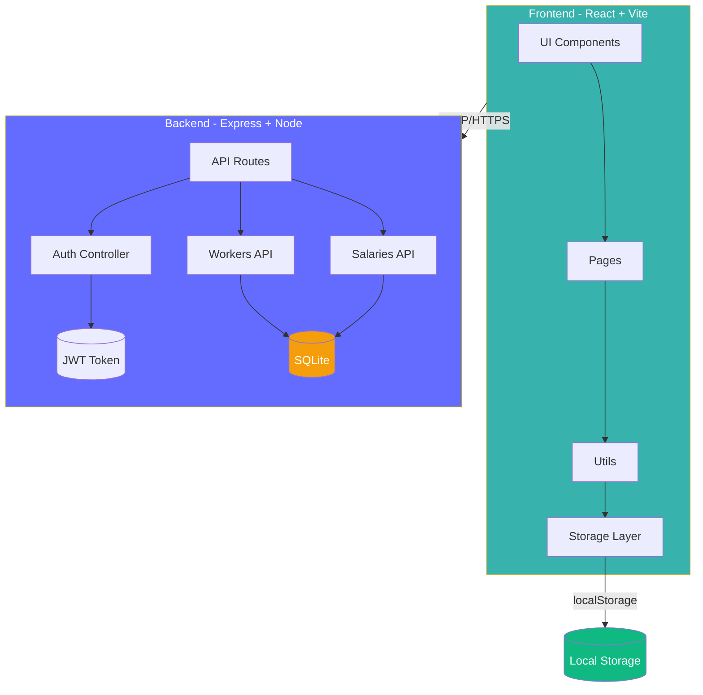

# 💰 Salary Manager Pro

<p align="center">
  
  
  
  
</p>

<p align="center">
  
  
  
  
</p>

---

<div align="center">

# 🚀 The Ultimate Salary Management Solution

*A modern, full-stack salary management system with worker tracking, salary calculations, PDF/Excel exports, and secure authentication.*

[]()
[]()
[]()

</div>

---

## ✨ Features

<table>
<tr>
<td valign="top">

### 👷 Worker Management
- Add, edit, and delete worker records
- Track mobile numbers, joining dates
- Active/Inactive status management

### 💰 Salary Management
- Calculate salaries with working days
- Advance payment tracking
- Automatic final salary computation

### 📅 Attendance Tracking
- Track daily attendance
- Monthly attendance reports
- Attendance-based salary calculation

</td>
<td valign="top">

### 📊 Analytics Dashboard
- Real-time statistics
- Total salary overview
- Advance payment tracking
- Visual data cards

### 📄 PDF Export
- Monthly salary reports
- Full database exports
- Professional formatted documents

### 📈 Excel Export
- Spreadsheet-compatible exports
- Formatted salary sheets
- Easy data analysis

</td>
</tr>
</table>

---

### 🔐 Security Features

| Feature | Description |
|---------|-------------|
| JWT Authentication | Secure token-based auth |
| Password Hashing | bcryptjs encryption |
| Protected Routes | Role-based access control |
| User Data Isolation | Per-user localStorage keys |
| Guest Mode | View-only demo access |

---

### 💾 Additional Features

- 🗑️ **Recycle Bin** - Soft delete with restore capability
- 💾 **Backup & Restore** - JSON backup system
- 🌙 **Dark Mode** - Easy on the eyes
- 📱 **Mobile Responsive** - Works on all devices
- 🎯 **Multi-User Support** - Isolated user data
- ⚡ **Fast Loading** - Optimized performance

---

## 🎬 Animated Demo

<details>
<summary><b>📺 Click to View Demo GIFs</b></summary>

### Dashboard


### Worker Management


### Salary Management


### Attendance


### PDF Export


### Excel Export


</details>

---

## 📸 Screenshots

<details>
<summary><b>🖼️ View Screenshots</b></summary>

| Dashboard | Workers | Salary |
|:---------:|:-------:|:------:|
|  |  |  |

| Attendance | Reports |
|:----------:|:-------:|
|  |  |

</details>

---

## 🛠️ Tech Stack

### Frontend
| Technology | Version | Purpose |
|-----------|---------|---------|
|  | 19.2.6 | UI Framework |
|  | 8.0.12 | Build Tool |
|  | 4.3.0 | Styling |
|  | 7.17.0 | Routing |

### Backend
| Technology | Version | Purpose |
|-----------|---------|---------|
|  | 18+ | Runtime |
|  | 4.19.2 | API Server |
|  | 9.0.2 | Authentication |
|  | 2.4.3 | Password Hashing |

### Libraries
| Library | Purpose |
|---------|---------|
|  | Excel Export |
|  | PDF Generation |
|  | PDF Tables |

---

## 📐 Architecture



---

## 📁 Project Structure

```
Salary-Manager-Pro/
├── assets/                 # Images and GIFs
├── public/                 # Static assets
├── server/                 # Backend server
│   ├── src/
│   │   └── server.js      # Express server
│   ├── .env               # Environment variables
│   └── package.json
├── src/                   # Frontend source
│   ├── components/
│   │   └── Navbar.jsx     # Navigation bar
│   ├── pages/
│   │   ├── AdminLogin.jsx
│   │   ├── Dashboard.jsx
│   │   ├── Workers.jsx
│   │   ├── Salaries.jsx
│   │   └── Attendance.jsx
│   ├── utils/
│   │   ├── auth.js        # Authentication
│   │   ├── authApi.js     # Auth API calls
│   │   ├── storage.js     # localStorage utils
│   │   ├── excelExport.js # Excel export
│   │   └── pdfExport.js   # PDF export
│   ├── App.jsx            # Main app
│   ├── main.jsx           # Entry point
│   └── index.css          # Global styles
├── package.json           # Frontend dependencies
├── vite.config.js         # Vite configuration
└── README.md              # This file
```

---

## 🚀 Installation Guide

### Prerequisites
- Node.js 18 or higher
- npm or yarn

### 1. Clone the Repository

```bash
git clone https://github.com/dipeshgirase12-ai/Salary-Manager-Pro.git
cd Salary-Manager-Pro
```

### 2. Install Frontend Dependencies

```bash
npm install
```

### 3. Install Backend Dependencies

```bash
cd server
npm install
cd ..
```

### 4. Configure Environment Variables

Create a `.env` file in the `server/` directory:

```bash
cd server
cp .env.example .env
```

Example `.env`:
```env
# Server Configuration
PORT=3001

# Admin Credentials
ADMIN_USERNAME=admin
ADMIN_PASSWORD_PLAIN=admin123

# JWT Secret (change in production!)
JWT_SECRET=your-super-secret-jwt-key-change-in-production
```

### 5. Start the Application

#### Start Frontend (in one terminal):
```bash
npm run dev
```

#### Start Auth Server (in another terminal):
```bash
npm run dev:auth
```

Or combined:
```bash
# Terminal 1: Frontend
npm run dev

# Terminal 2: Backend
cd server && npm run dev
```

### 6. Access the Application

Open your browser and navigate to:
- **Frontend:** http://localhost:5173
- **Auth Server:** http://localhost:3001

### 7. Demo Access (No Login Required)

To view the demo without registering:
1. On the login page, click **"Continue as Guest"**
2. You'll have view-only access to the dashboard, workers, and salaries pages
3. All add/edit/delete buttons will be hidden in guest mode

---

## 🔐 User Roles & Access Modes

### 👤 Guest Mode (Demo)
| Permission | Status |
|------------|--------|
| View Dashboard | Allowed |
| View Workers | Allowed |
| View Salaries | Allowed |
| Add/Edit/Delete | Disabled |
| Export Data | Disabled |
| Backup/Restore | Disabled |

### 👨‍💻 Admin Mode (Full Access)
| Permission | Status |
|------------|--------|
| View Dashboard | Allowed |
| View Workers | Allowed |
| View Salaries | Allowed |
| Add/Edit/Delete | Allowed |
| Export Data | Allowed |
| Backup/Restore | Allowed |

---

## 📡 API Documentation

### Authentication APIs

| Endpoint | Method | Description |
|----------|--------|-------------|
| `/api/admin/login` | POST | Admin login with JWT |

**Request Body:**
```json
{
  "username": "admin",
  "password": "admin123"
}
```

**Response:**
```json
{
  "ok": true,
  "token": "eyJhbGciOiJIUzI1...",
  "userId": "admin"
}
```

### Dashboard APIs

| Endpoint | Method | Description |
|----------|--------|-------------|
| `/api/dashboard/stats` | GET | Get dashboard statistics |

### Workers APIs

| Endpoint | Method | Description |
|----------|--------|-------------|
| GET all workers | GET | Retrieve all workers |
| GET worker by ID | GET | Get single worker |
| POST new worker | POST | Create new worker |
| PUT update worker | PUT | Update existing worker |
| DELETE worker | DELETE | Delete worker |

### Salary APIs

| Endpoint | Method | Description |
|----------|--------|-------------|
| GET all salaries | GET | Retrieve all salaries |
| GET salary by ID | GET | Get single salary |
| POST new salary | POST | Create new salary |
| PUT update salary | PUT | Update existing salary |
| DELETE salary | DELETE | Delete salary |

### Export APIs

| Endpoint | Method | Description |
|----------|--------|-------------|
| GET /export/excel | GET | Export to Excel |
| GET /export/pdf | GET | Export to PDF |
| GET /export/pdf/full | GET | Full database PDF |

---

## 🔒 Security Features

```
+-------------------------------------------------------------+
|                    SECURITY ARCHITECTURE                    |
+-------------------------------------------------------------+
|                                                             |
|  +-------------+    +-------------+    +-------------+      |
|  |   JWT      |    |  bcrypt     |    |  Route      |      |
|  |  Tokens    |----|  Hashing    |----|  Guards     |      |
|  +-------------+    +-------------+    +-------------+      |
|        |                  |                  |               |
|        v                  v                  v               |
|  +-------------+    +-------------+    +-------------+      |
|  |  SQLite     |    | Per-User    |    |  Role       |      |
|  |  Database   |    |  Isolation  |    |   Based     |      |
|  +-------------+    +-------------+    +-------------+      |
|                                                             |
+-------------------------------------------------------------+
```

---

## 🚀 Performance Optimizations

| Feature | Implementation |
|---------|----------------|
| Fast Loading | Vite's optimized build |
| Optimized Queries | localStorage indexing |
| Responsive UI | Tailwind CSS utilities |
| Minimal Rerenders | React hooks optimization |
| Smart Caching | useMemo & useCallback |

---

## 🌟 Roadmap

```
+-------------------------------------------------------------+
|                    FUTURE FEATURES                          |
+-------------------------------------------------------------+
|                                                             |
|  Android App       ---->  React Native mobile app           |
|  Cloud Sync        ---->  Multi-device synchronization      |
|  WhatsApp Reports  ---->  Automated WhatsApp alerts         |
|  Multi-Company     ---->  Multi-tenant architecture        |
|  Payroll Automation ---->  Auto salary calculations         |
|  Advanced Analytics ---->  Charts & visualizations          |
|  Push Notifications ---->  Browser push notifications       |
|  PWA Support       ---->  Progressive web app              |
|                                                             |
+-------------------------------------------------------------+
```

---

## 🤝 Contributing

Contributions are welcome! Please follow these steps:

1. **Fork the repository**
2. **Create your feature branch**
   ```bash
   git checkout -b feature/AmazingFeature
   ```
3. **Commit your changes**
   ```bash
   git commit -m 'Add some AmazingFeature'
   ```
4. **Push to the branch**
   ```bash
   git push origin feature/AmazingFeature
   ```
5. **Open a Pull Request**

---

## 📜 License

This project is licensed under the MIT License - see the [LICENSE](LICENSE) file for details.

```
MIT License

Copyright (c) 2024 Salary Manager Pro
Created by Dipesh Girase

Permission is hereby granted, free of charge, to any person obtaining a copy
of this software and associated documentation files (the "Software"), to deal
in the Software without restriction, including without limitation the rights
to use, copy, modify, merge, publish, distribute, sublicense, and/or sell
copies of the Software, and to permit persons to whom the Software is
furnished to do so, subject to the following conditions:

The above copyright notice and this permission notice shall be included in all
copies or substantial portions of the Software.

THE SOFTWARE IS PROVIDED "AS IS", WITHOUT WARRANTY OF ANY KIND, EXPRESS OR
IMPLIED, INCLUDING BUT NOT LIMITED TO THE WARRANTIES OF MERCHANTABILITY,
FITNESS FOR A PARTICULAR PURPOSE AND NONINFRINGEMENT. IN NO EVENT SHALL THE
AUTHORS OR COPYRIGHT HOLDERS BE LIABLE FOR ANY CLAIM, DAMAGES OR OTHER
LIABILITY, WHETHER IN AN ACTION OF CONTRACT, TORT OR OTHERWISE, ARISING FROM,
OUT OF OR IN CONNECTION WITH THE SOFTWARE OR THE USE OR OTHER DEALINGS IN THE
SOFTWARE.
```

---

## 👨‍💻 Developer Profile

<p align="center">

<a href="https://github.com/dipeshgirase12-ai">
  
</a>

<a href="https://www.linkedin.com/in/dipesh-girase-4598b52b2">
  
</a>

</p>

### Made with ❤️ by Dipesh Girase

*Full-Stack Developer | React Enthusiast | Problem Solver*

---

**Connect with me:**
- GitHub: [dipeshgirase12-ai](https://github.com/dipeshgirase12-ai)
- LinkedIn: [Dipesh Girase](https://www.linkedin.com/in/dipesh-girase-4598b52b2)

---

**Star this repo if you like it!**

[]()
[]()

---

<p align="center">
  <strong>© 2024 Salary Manager Pro. All rights reserved.</strong>
</p>

<p align="center">
  <a href="#">Back to top</a>
</p>
